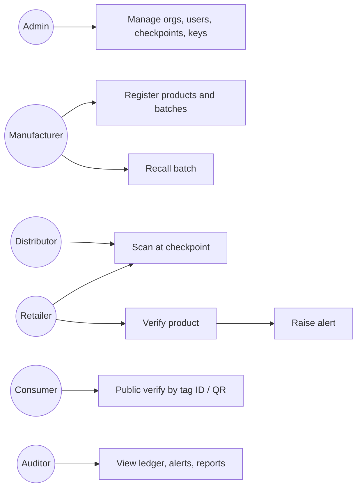
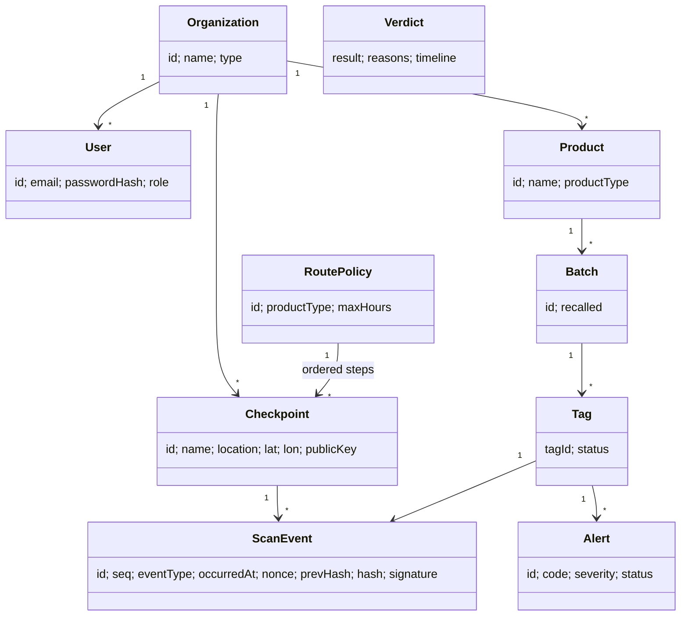
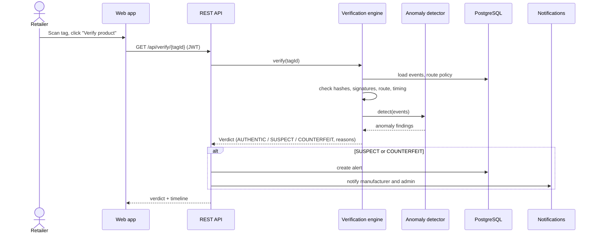
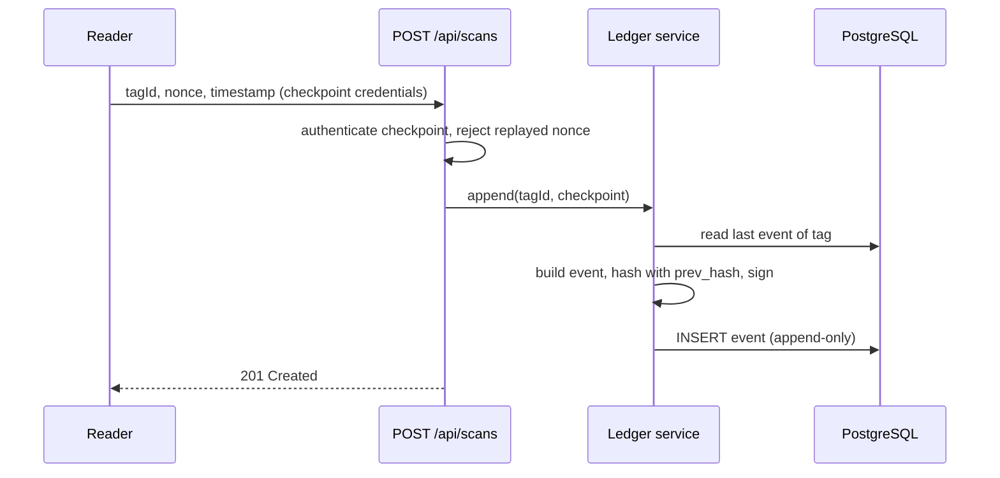

# UML diagrams

Rendered automatically by GitHub (Mermaid).

## Use case

```mermaid
flowchart LR
    Admin((Admin)) --> UC1[Manage orgs, users, checkpoints, keys]
    Manufacturer((Manufacturer)) --> UC2[Register products and batches]
    Manufacturer --> UC3[Recall batch]
    Distributor((Distributor)) --> UC4[Scan at checkpoint]
    Retailer((Retailer)) --> UC4
    Retailer --> UC5[Verify product]
    Consumer((Consumer)) --> UC6[Public verify by tag ID / QR]
    Auditor((Auditor)) --> UC7[View ledger, alerts, reports]
    UC5 --> UC8[Raise alert]
```

## Domain classes

```mermaid
classDiagram
    class Organization { id; name; type }
    class User { id; email; passwordHash; role }
    class Checkpoint { id; name; location; lat; lon; publicKey }
    class Product { id; name; productType }
    class Batch { id; recalled }
    class Tag { tagId; status }
    class ScanEvent { id; seq; eventType; occurredAt; nonce; prevHash; hash; signature }
    class RoutePolicy { id; productType; maxHours }
    class Alert { id; code; severity; status }
    class Verdict { result; reasons; timeline }

    Organization "1" --> "*" User
    Organization "1" --> "*" Checkpoint
    Organization "1" --> "*" Product
    Product "1" --> "*" Batch
    Batch "1" --> "*" Tag
    Tag "1" --> "*" ScanEvent
    Checkpoint "1" --> "*" ScanEvent
    RoutePolicy "1" --> "*" Checkpoint : ordered steps
    Tag "1" --> "*" Alert
```

## Sequence: retailer verifies a product

```mermaid
sequenceDiagram
    actor Retailer
    participant UI as Web app
    participant API as REST API
    participant V as Verification engine
    participant A as Anomaly detector
    participant DB as PostgreSQL
    participant N as Notifications

    Retailer->>UI: Scan tag, click "Verify product"
    UI->>API: GET /api/verify/{tagId} (JWT)
    API->>V: verify(tagId)
    V->>DB: load events, route policy
    V->>V: check hashes, signatures, route, timing
    V->>A: detect(events)
    A-->>V: anomaly findings
    V-->>API: Verdict (AUTHENTIC / SUSPECT / COUNTERFEIT, reasons)
    alt SUSPECT or COUNTERFEIT
        API->>DB: create alert
        API->>N: notify manufacturer and admin
    end
    API-->>UI: verdict + timeline
```

## Sequence: scan ingestion

```mermaid
sequenceDiagram
    participant R as Reader
    participant API as POST /api/scans
    participant L as Ledger service
    participant DB as PostgreSQL

    R->>API: tagId, nonce, timestamp (checkpoint credentials)
    API->>API: authenticate checkpoint, reject replayed nonce
    API->>L: append(tagId, checkpoint)
    L->>DB: read last event of tag
    L->>L: build event, hash with prev_hash, sign
    L->>DB: INSERT event (append-only)
    API-->>R: 201 Created
```
